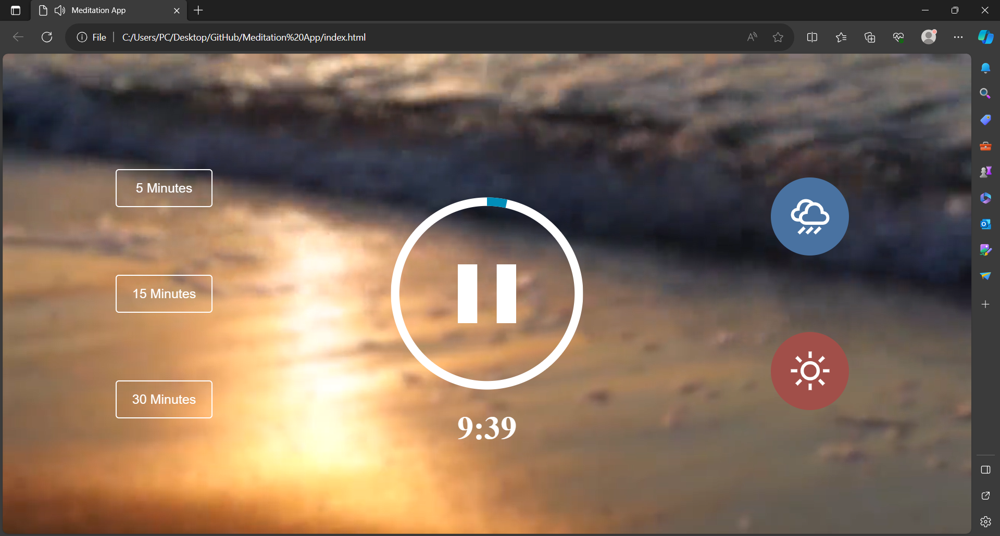

# meditation
Meditation App

Description
This meditation app allows users to choose meditation durations (10, 15, or 30 minutes) and ambient sounds (ocean waves and rainfall) for relaxation and focus.

Technologies
The app is developed using:

HTML
CSS
SCSS
JavaScript
Features
Meditation Duration Selection
Users can select from various meditation durations:

10 minutes
15 minutes
30 minutes
Ambient Sounds
Users can choose their preferred ambient sound for meditation:

Ocean Waves
Rainfall
Installation
Clone this repository to your local machine using git clone.
Open the index.html file in a web browser.
How to Use
Choose the desired meditation duration by clicking on the corresponding option (10, 15, or 30 minutes).
Select your preferred ambient sound by clicking on either "Ocean Waves" or "Rainfall."
Feel free to elaborate further on specific functionalities, add screenshots, or include any additional instructions for contributors or users!
